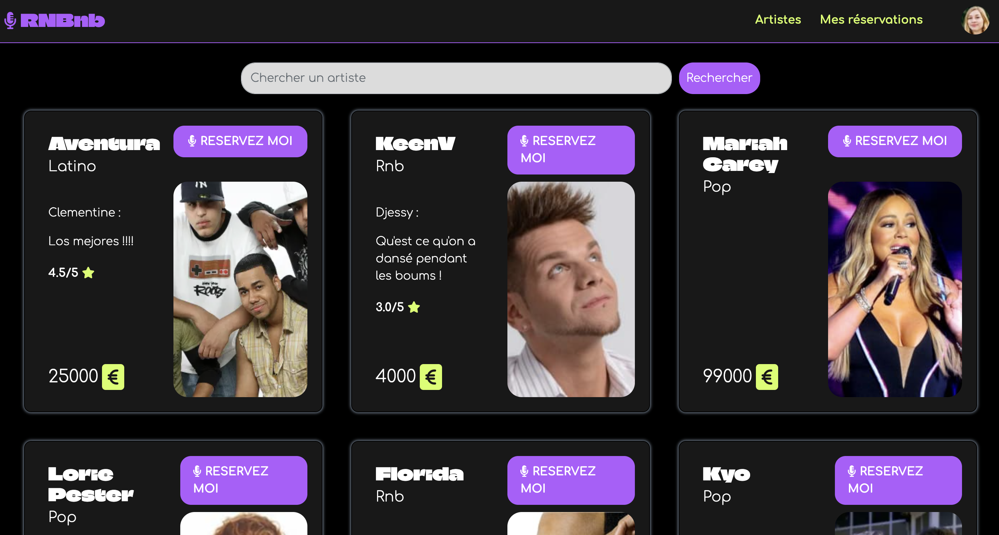
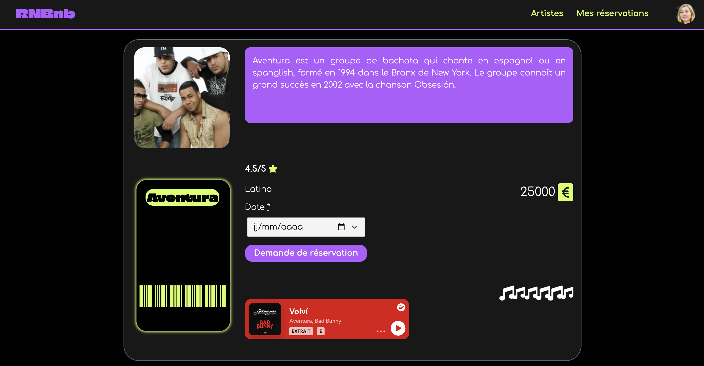
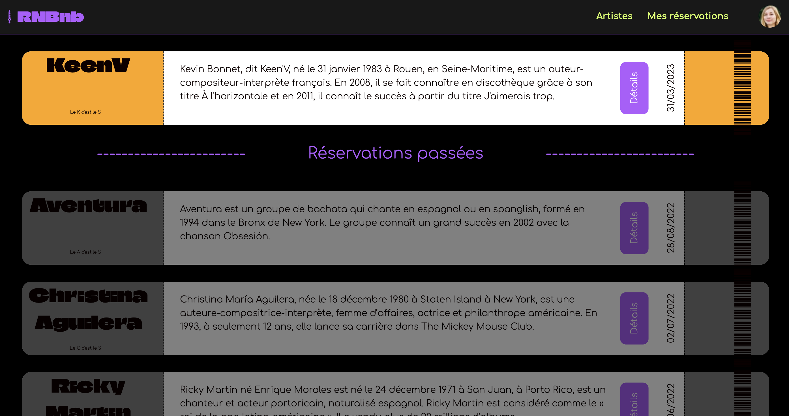
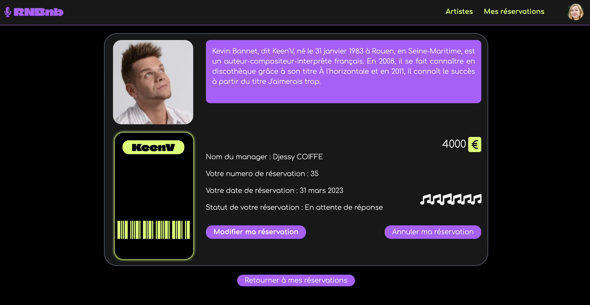

<h1>RNRnb</h1>

A clone of AirBnb to rent has been Rnb artists, developed as a project during the Le Wagon Bootcamp.

<li>
  <ul>A ruby on rails MVC</ul>
  <ul>Gem Devise for authentication</ul>
  <ul>Namespacing for different kinds of ursers (manager and renter)</ul>
  <ul>Call to Spotify dev API for music</ul>
  <ul>Cloudinary for hosting pictures</ul>
  <ul>PostgreSQL for DB</ul>
  <ul>An accepted has been front with an years 2000 inspo</ul>
</li>

---

You can check it here : https://https://airbnb-djessy-lab.herokuapp.com/

